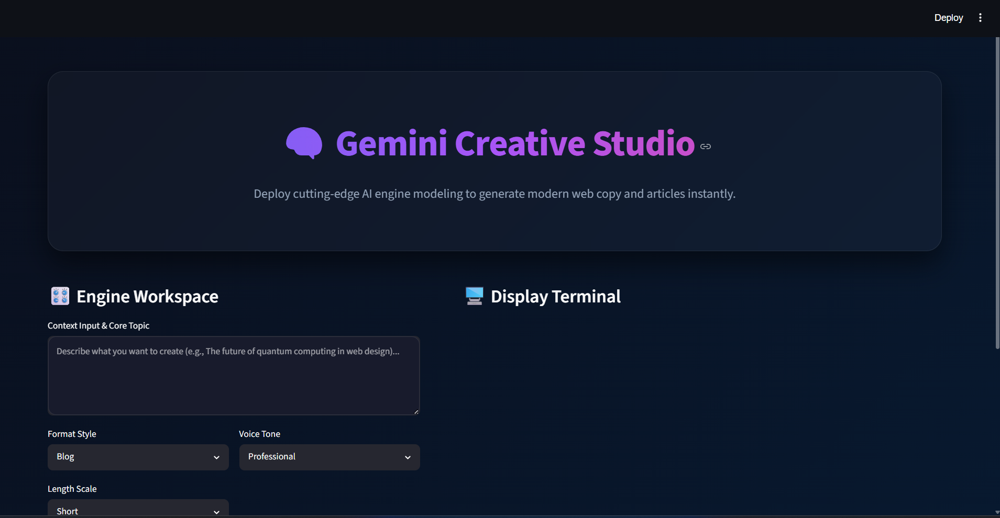

# 🧠 Gemini Creative Studio

> An AI-powered content generation platform built with Streamlit and Google Gemini AI that creates high-quality blogs, emails, Instagram captions, and product descriptions in seconds.

---

## ✨ Overview

Gemini Creative Studio is a modern AI content generation application designed to help users create professional-quality content instantly.

Powered by Google's Gemini AI model, the application transforms simple prompts into engaging and structured content while providing a sleek glassmorphism-inspired user experience.

Whether you're a content creator, marketer, entrepreneur, student, or developer, Gemini Creative Studio helps you generate content faster and more efficiently.

---

## 🚀 Features

### 📝 AI Blog Generator

Generate detailed and structured blog articles with:

* Title
* Introduction
* Multiple Content Sections
* Conclusion

### 📧 Professional Email Generator

Create professional emails including:

* Subject Line
* Greeting
* Body Content
* Call-to-Action

### 🛍️ Product Description Generator

Generate persuasive product descriptions with:

* Feature Highlights
* Benefits
* Marketing Copy
* Conversion-Focused Content

### 📱 Instagram Caption Generator

Create engaging captions featuring:

* Creative Hooks
* Emojis
* Trending Hashtags
* Social Media Friendly Formatting

### 🎨 Modern User Interface

* Animated Gradient Background
* Glassmorphism Design
* Interactive Metrics Dashboard
* Typing Animation Effect
* Responsive Layout

### 📊 Content Analytics

View:

* Word Count
* Character Count
* Generated Content Type

### 📥 Export & Copy

* Download generated content as TXT
* Quick copy functionality

---

## 🛠️ Tech Stack

| Technology       | Purpose                   |
| ---------------- | ------------------------- |
| Python           | Core Programming Language |
| Streamlit        | Web Application Framework |
| Google Gemini AI | Content Generation        |
| HTML/CSS         | Custom UI Styling         |
| Session State    | State Management          |

---

## 📂 Project Structure

```text
AI-Content-Generator/
│
├── app.py
├── secret.py
├── requirements.txt
├── README.md
├── .gitignore
└── screenshots/
```

---

## ⚙️ Installation

### 1️⃣ Clone the Repository

```bash
git clone https://github.com/your-username/AI-Content-Generator.git
cd AI-Content-Generator
```

### 2️⃣ Install Dependencies

```bash
pip install -r requirements.txt
```

### 3️⃣ Add Gemini API Key

Create a file named:

```python
secret.py
```

Add:

```python
API_KEY = "YOUR_GEMINI_API_KEY"
```

### 4️⃣ Run the Application

```bash
streamlit run app.py
```

---

## 🎯 Example Use Cases

### Blog Generation

Input:

```text
Artificial Intelligence in Healthcare
```

Output:

✔ Structured Blog

✔ SEO-Friendly Content

✔ Professional Formatting

---

### Instagram Caption

Input:

```text
Summer Travel Photography
```

Output:

✔ Creative Caption

✔ Emojis Included

✔ Relevant Hashtags

---

### Product Description

Input:

```text
Wireless Noise Cancelling Headphones
```

Output:

✔ Product Benefits

✔ Key Features

✔ Marketing-Oriented Copy

---

## 📸 Application Preview

### Home Dashboard


### Blog Generation



### Email Generation

*Add screenshot here*

### Product Description Generation

*Add screenshot here*

### Instagram Caption Generation

*Add screenshot here*

---

## 🔐 Security Note

Never upload:

```text
secret.py
.env
API Keys
```

Add them to:

```text
.gitignore
```

Example:

```text
secret.py
.env
__pycache__/
```

---

## 🌟 Future Enhancements

* PDF Export
* Content History
* Multi-Language Support
* AI Image Generation
* Voice-Based Prompts
* User Authentication
* Cloud Database Integration

---

## 📈 Learning Outcomes

This project helped develop practical experience in:

* Prompt Engineering
* Generative AI Integration
* API Handling
* Streamlit Development
* UI/UX Design
* State Management
* Error Handling
* Deployment Workflows

---

## 👨‍💻 Author

**Dhanush**

AI Enthusiast • Python Developer • Machine Learning Learner

---

## ⭐ Support

If you found this project useful, consider giving it a ⭐ on GitHub.

It helps others discover the project and motivates future improvements.
